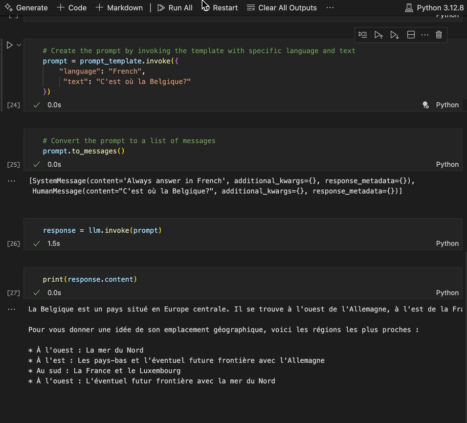

# LangChain LLM Tutorial bit by bit...

Welcome to the LangChain LLM tutorial! This guide is designed to help you learn LangChain step by step, at a slow and deliberate pace. Rushing often leads to mistakes, and we want to ensure you have a solid understanding at every stage.

# About This Tutorial
LangChain is a powerful framework for building applications using large language models (LLMs). 
However, due to its complexity, it’s easy to become overwhelmed if you try to move too quickly. 
This tutorial is intentionally structured to:

- Emphasize gradual learning.
- Break down complex topics into manageable steps.
- Provide clear examples and exercises.

**We will use LangChain only, no LangGraph nor LangSmith** 

*(...at the time of writing this I don't even know what they do 😂)*

---

# Structure of the Tutorial

1. Talk to the LLM<br>
[01.llm_template.ipynb](01.llm_template.ipynb): Ask simple questions to a LLM

2. Vectors and embedding<br>
[02.embeddings_vectors.ipynb](02.embeddings_vectors.ipynb): How to use Embedding we can use for RAG's

3. Classification<br>
[03.classify.ipynb](03.classify.ipynb): Classify a message using pydantic object and ChatPromptTemplate

4. Extraction<br>
[04.extraction.ipynb](04.extraction.ipynb): Same but for structured data extraction

5. Tools calling<br>
[05.tool_calling.ipynb](05.tool_calling.ipynb): Tool calling, also known as function calling, enables AI models to interact with systems like APIs or databases by responding in a schema-specific format

6. Short-Term Memory<br>
[06.short_memory.ipynb](06.short_memory.ipynb): The code creates a chatbot with short-term memory using ChatOllam.

7. Long-Term Memory<br>
[07.long_memory.ipynb](07.long_memory.ipynb): This code builds a chatbot that remembers and retrieves past conversations using a database, allowing it to provide personalized and context-aware responses.

8. Runnable<br>
[08.runnable.ipynb](08.runnable.ipynb): This code demonstrates the Runnable concept by building a pipeline of chained transformations—adding context, generating a response with a language model, and post-processing the output—showcasing how LangChain organizes and executes workflows efficiently.

9. Agent<br>
[09.agent.ipynb](09.agent.ipynb): An agent dynamically selects tools and actions based on input, offering flexibility, efficiency, and scalability, while a pipeline processes inputs linearly through predefined steps without decision-making.
---

# How to Install and run the Notebooks on your Docker

## Docker

To be fully independant and be able to practice anywhere, I'm using two small Docker containers:
1) One for [**Ollama**](https://ollama.com/search) with a couple of models (llama,)
2) One as my **development container** with Python 3.12 and the LangChain libraries I need

## Ollama
The models I use:
```
NAME                        ID              SIZE      MODIFIED    
phi3:14b                    cf611a26b048    7.9 GB    2 days ago     
mxbai-embed-large:latest    468836162de7    669 MB    5 days ago     
mistral:latest              f974a74358d6    4.1 GB    9 days ago     
llama3.2:latest             a80c4f17acd5    2.0 GB    11 days ago  
```

## VSCode

Then, using VSCode, you can [**"Attach Visual Studio Code"**](https://code.visualstudio.com/docs/devcontainers/containers) and run all examples with Jupyter plugins 

<p align="center"></p>

... and you're the king of the world

## Notes
- We'll use Ollama to avoid expenses associated with LLM like GPT. No need API keys nor Credit Card. 
- Results may be a bit less accurate than GPT but we wanna learn first.
- The version of LangChain installed should be 0.3+ (important)
- Ollama [is easy to install using Docker](https://github.com/ollama/ollama/blob/main/docs/docker.md). 
(Better to have a GPU, even a small one)
- I give an example of Dockerfile and docker-compose.yaml using Python 3.12 (I have to test this...)
- You can then use an evironment variable OLLAMA_SERVER (ex. OLLAMA_SERVER='http://ollama:11434') from this container [running Jupyter](https://jupyterlab.readthedocs.io/en/4.1.x/getting_started/installation.html)
- Required Python packages from `requirements.txt` file should be build with the Dockerfile.

A simple `docker-compose up -d` should do the trick

---

## Tips for Success
- **Take Your Time**: Resist the urge to skip steps or rush through sections.
- **Experiment**: Modify the examples and test your ideas.
- **Ask Questions**: Engage with the LangChain community if you encounter issues.

---

## Contribution
This is a community-driven effort, and your feedback is valuable. If you find errors or have suggestions for improvement, please submit an issue or pull request.

Happy Learning!